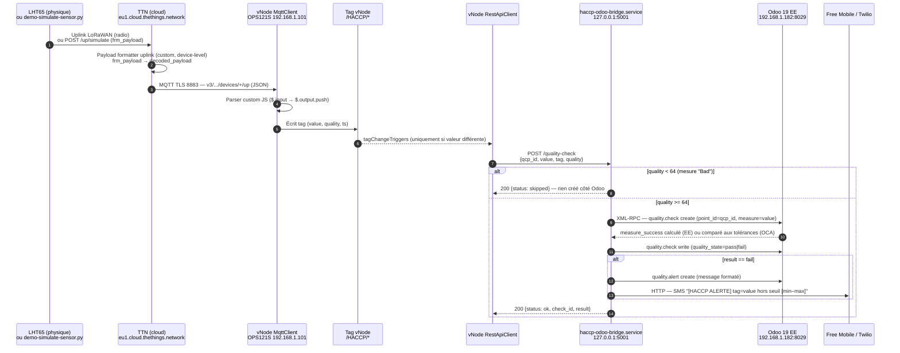

# Architecture actuelle — Pipeline bout-en-bout

> Synthèse des trois documents précédents (`architecture-reseau.md`, `architecture-ops121s-vnode.md`, `architecture-odoo.md`) : trace complète d'une mesure, du capteur (ou de sa simulation) jusqu'à l'alerte SMS, avec les composants exacts et les points de décision réels du code.

## Schéma

## Étapes en détail

1. **Émission de la mesure.** Aujourd'hui, un seul capteur réel est provisionné (`lht65-frigo-positif`, voir `architecture-reseau.md`). En l'absence de gateway LoRaWAN physique, `scripts/demo-simulate-sensor.py` encode les 6 bytes du protocole LHT65 (`frm_payload`) et appelle l'API TTN `/up/simulate` — ce qui exerce le vrai formatter TTN, pas un raccourci.

2. **Décodage côté TTN.** Le formatter uplink custom (au niveau device, override de l'application) décode `frm_payload` en `temperature_1`/`humidity`/`battery_voltage`. Le codec standard du Device Repository n'est pas utilisé — il crashe sur les bytes du capteur externe.

3. **Livraison MQTT.** TTN publie sur `v3/haccp-restaurant-poc@ttn/devices/+/up`, vNode MqttClient est abonné avec un parser **custom** (obligatoire, `mqttJson` ne convient pas ici — voir `architecture-ops121s-vnode.md` §3.1).

4. **Écriture des tags.** Le script du parser pousse une valeur par mesure vers `/HACCP/Frigo_Temperature`, `/HACCP/Frigo_Humidity`, etc.

5. **Déclenchement RestApiClient.** Ce module ne réagit **que sur changement de valeur** du tag (`tagChangeTriggers`) — renvoyer deux fois la même valeur ne produit aucun nouvel appel HTTP. C'est un comportement à connaître en démo (varier la valeur entre deux tests, ou redémarrer `vnode.service`).

6. **Appel au bridge.** `POST http://127.0.0.1:5001/quality-check` avec `{qcp_id, value, tag, quality}` — `qcp_id` fait le lien direct avec le `quality.point` Odoo (1=Frigo, 2=Congélateur, 3=Stockage).

7. **Filtrage qualité.** Le bridge ignore silencieusement (`200 {status: skipped}`, aucune écriture Odoo) toute mesure avec `quality < 64` (capteur déconnecté au sens OPC — 0–63 Bad, 64–127 Uncertain, 192–255 Good).

8. **Création du contrôle qualité.** Deux implémentations existent dans `bridge.py`, sélectionnées par `ODOO_QUALITY_BACKEND` (`ee` par défaut) :
   - **EE** (`_create_quality_check_ee`) : crée le `quality.check`, relit `measure_success` (champ calculé automatiquement par Odoo EE), puis écrit `quality_state` explicitement avec cette valeur.
   - **OCA** (`_create_quality_check_oca`) : pas de champ calculé équivalent — le bridge relit lui-même `tolerance_min`/`tolerance_max` sur le `quality.point` et compare manuellement.

9. **Alerte si hors tolérance.** Si `result == "fail"` : création d'un `quality.alert` avec un message formaté, **et** envoi SMS synchrone depuis le bridge lui-même (pas via une automatisation Odoo) — Free Mobile si configuré, sinon Twilio. Tout se passe dans le même cycle de requête HTTP que l'étape 6, avant que le bridge ne réponde `200` à vNode.

10. **Erreur Odoo.** Si l'appel XML-RPC échoue, le bridge répond `500` et réinitialise sa session Odoo (`_odoo_uid`/`_odoo_models` remis à `None`) pour forcer une ré-authentification au prochain appel.

## Latence de bout en bout (constatée en démo)

Pas de file d'attente ni de traitement asynchrone à aucune étape : chaque maillon appelle le suivant de façon synchrone (MQTT push → parser → tag → HTTP POST → XML-RPC → SMS HTTP). La latence observée en démo (uplink simulé → SMS reçu) est de l'ordre de quelques secondes, dominée par les allers-retours réseau MQTT/HTTP/XML-RPC, pas par un quelconque polling.

## Second pipeline, indépendant : étiquettes DLC

Le portail cuisine (`/haccp/etiquette/...`, voir `architecture-odoo.md` §3.1d) est un flux **entièrement séparé** qui ne passe pas par ce pipeline capteurs — il part directement d'une saisie humaine sur le portail Odoo et va vers l'imprimante Zebra (192.168.1.31:9100) en ZPL. Les deux pipelines partagent uniquement le même serveur Odoo comme backend.

## Écarts avec la cible production

Aucun nouvel écart propre à ce document — il hérite de ceux déjà listés dans `architecture-ops121s-vnode.md`, `architecture-odoo.md` et `architecture-reseau.md` (pas de gateway physique, réseau à plat, instances Odoo en Docker). Point spécifique à surveiller si un client réel est onboardé : le bridge envoie les SMS **lui-même**, en clair via HTTP GET (Free Mobile) ou HTTP POST Basic Auth (Twilio) — pas de file de retry ni d'accusé de réception au-delà du `try/except` qui log l'erreur sans la remonter à vNode ; une panne de l'API SMS externe est silencieuse du point de vue du pipeline (le `quality.alert` est tout de même créé dans Odoo).
