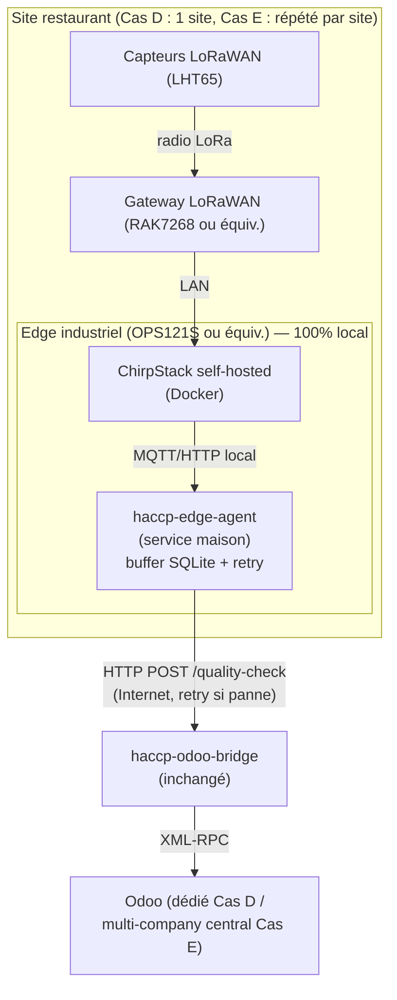

# Spec — Sortie de vNode : agent maison + ChirpStack local (Cas D & Cas E)

**Date :** 2026-07-22
**Statut :** Design approuvé — prêt pour plan d'implémentation
**Auteur :** Brainstorming AIFluence Digital
**Périmètre :** Remplacer vNode par un agent logiciel maison dans les architectures Cas D (restaurant indépendant avec edge node) et Cas E (chaîne multi-sites), en réévaluant au passage le choix du LNS (TTN vs ChirpStack) et son emplacement.

**Amende** `docs/superpowers/specs/2026-05-22-haccp-architectures-tiers-design.md` — décision D3 (vNode comme composant de référence Cas D) et les sections Cas C, D, E. Ce document ne remet pas en cause le reste du spec tiers (Cas A, B, F inchangés).

---

## 1. Contexte

Le spec tiers du 2026-05-22 avait défini 6 scénarios d'architecture (Cas A→F) et retenu vNode comme composant central du Cas D (architecture POC actuelle) et du Cas E (chaîne, non développé). Le Cas C (ChirpStack + vNode sur VPS) était bloqué sur une question de licence vNode en MAC virtuel, jamais résolue.

Deux éléments nouveaux motivent la reprise de cette réflexion :
1. **Coût vNode chiffré** : 1300€ (licence MAC physique, par site) ou 2600€ (licence MAC virtuel/VPS) selon l'architecture — un coût qui n'était pas explicitement isolé dans les estimations "coût logiciel" du spec tiers, et qui se multiplie par site en Cas E (chaîne).
2. **Analyse du pipeline réel** (voir `docs/operations/architecture-pipeline-bout-en-bout.md`) : vNode, dans l'usage actuel, se limite à trois fonctions — s'abonner en MQTT à TTN avec un parser custom, détecter un changement de valeur de tag, et faire un `POST` HTTP vers le bridge Odoo. Aucune de ces fonctions n'exploite les capacités "industrielles" propriétaires de vNode (multi-protocoles Modbus/OPC-UA, configuration no-code).

## 2. Problème à résoudre

vNode est-il indispensable dans l'architecture actuelle, sachant que :
- son coût (1300-2600€/site) devient significatif à l'échelle d'une chaîne (Cas E),
- sa seule fonction réellement utilisée aujourd'hui (bridge protocolaire + buffer local) est reproductible par un composant maison simple,
- une contrainte produit forte a été confirmée pendant le brainstorming : **zéro trou dans l'historique de mesures HACCP, même en cas de panne du VPS Odoo** (argument de vente à garantir, pas un best-effort).

## 3. Analyse — décomposition en axes indépendants

La discussion a mélangé plusieurs décisions au départ ; les séparer clarifie l'espace des solutions.

**Axe 1 — Faut-il un buffer local, découplé du VPS Odoo ?**
Oui, tranché : la contrainte "zéro trou" exige un composant qui continue de capter les mesures même si le VPS Odoo est injoignable, et qui les rejoue à son retour. Un système 100% cloud sans aucun composant indépendant du VPS Odoo ne peut pas satisfaire cette exigence (si le VPS tombe, tout ce qui est co-localisé dessus tombe avec lui).

**Axe 2 — Faut-il vNode pour ce buffer, ou un agent maison suffit ?**
Un agent maison suffit. Les trois fonctions utilisées (souscription MQTT + parsing custom, buffer SQLite, retry HTTP vers le bridge) sont déjà écrites dans la config vNode actuelle (parser JS documenté dans `architecture-ops121s-vnode.md`) et portables en quelques dizaines de lignes de Python. Aucun usage actuel ni prévu à court terme du reste des capacités vNode (multi-protocoles industriels, no-code).

**Axe 3 — Quel LNS (TTN ou ChirpStack), et où tourne-t-il ?**
Question indépendante des deux précédentes. Croisée avec l'emplacement du buffer/agent, elle détermine si l'architecture résiste aussi à une **coupure Internet du restaurant** (pas seulement à une panne du VPS Odoo) :
- Avec TTN (cloud) ou ChirpStack hébergé sur un VPS distant, la gateway a de toute façon besoin d'Internet pour atteindre le LNS — une coupure Internet locale reste un trou incompressible, quel que soit l'emplacement du buffer.
- Avec ChirpStack hébergé **localement sur l'edge du site**, la chaîne gateway → LNS → buffer reste entièrement sur le réseau local — seule la synchronisation finale vers Odoo a besoin d'Internet, et c'est justement ce que le buffer encaisse déjà.

**Axe 4 — La gateway LoRaWAN**
Composant physique obligatoire, non concerné par cette réflexion (aucune alternative logicielle possible — un capteur LoRaWAN ne peut physiquement joindre un LNS sans gateway à portée radio). Coût one-shot ~120€/site, inchangé quel que soit le LNS choisi derrière.

**Axe 5 — Résilience réseau local (dual-WAN)**
Réduit (sans l'éliminer) le risque de coupure Internet resto — mais avec l'option ChirpStack local (Axe 3), ce risque est déjà couvert pour la capture des données (pas pour la vitesse de synchronisation/alerte temps réel). Traité comme une option indépendante, pas une nécessité de résilience.

## 4. Options évaluées

| # | LNS | Emplacement LNS | Agent maison | Résiste panne VPS Odoo | Résiste coupure Internet resto | Coût additionnel/site |
|---|---|---|---|:---:|:---:|---|
| 1 | TTN cloud | Managé TTI | Sur edge local | ✓ | ✗ | 0€ |
| 2 | TTN cloud | Managé TTI | Sur VPS indépendant | ✓ | ✗ | ~5€/mois, zéro matériel sur site |
| 3 | ChirpStack self-hosted | VPS indépendant | Même VPS ou séparé | ✓ | ✗ | ~15€/mois |
| **4** | **ChirpStack self-hosted** | **Sur l'edge local (OPS121S ou équiv.)** | **Même edge** | **✓** | **✓** | **0€** (logiciel additionnel sur matériel déjà budgété) |

Le choix se réduit ensuite à deux profils : **Option 4** (résilience complète, coût matériel déjà amorti) pour les sites avec edge node, **Option 2** (zéro empreinte matérielle) pour un tier "lean" sans edge node.

## 5. Décision retenue

- **Cas D (restaurant indépendant, edge node présent)** → Option 4. ChirpStack self-hosted sur l'OPS121S existant (ou équivalent industriel fanless), agent maison sur la même machine.
- **Cas E (chaîne multi-sites)** → Option 4, répliquée par site, de façon totalement autonome. Chaque site a son propre ChirpStack local — **pas de ChirpStack central mutualisé** contrairement au brouillon initial du Cas E (simplification : plus de question de multi-tenance au niveau LNS, seul Odoo reste centralisé/multi-company).
- **Tier "lean" (petit resto sans edge node, esprit Cas B)** reste disponible en Option 2 — non traité en détail ici, aucun changement par rapport au Cas B existant hormis l'absence de vNode (qui n'y était de toute façon pas prévu).
- **Dual-WAN (Dream Machine SE)** repositionné comme **option premium "temps réel garanti"**, proposable indépendamment du reste, pas comme pré-requis de résilience.

**Rejeté :** garder vNode (sur edge ou VPS) — aucune fonction non couverte par l'agent maison n'est utilisée aujourd'hui ; à réévaluer uniquement si un client demande une intégration de matériel industriel filaire (Modbus/OPC-UA), cas non identifié à ce jour.

## 6. Architecture cible

Composants par site :
- **Gateway LoRaWAN** — inchangé (Axe 4).
- **Edge industriel** — matériel déjà utilisé aujourd'hui (OPS121S), vNode désinstallé.
- **ChirpStack self-hosted** — nouveau conteneur Docker sur l'edge, ajouté au `docker-compose.yml` existant (`infra/ops121s/`), aux côtés de Mosquitto/InfluxDB/Portainer.
- **`haccp-edge-agent`** — nouveau service maison (Python, systemd — même schéma de déploiement que `haccp-odoo-bridge.service`), remplace les modules vNode MqttClient + RestApiClient.
- **`haccp-odoo-bridge`** — **inchangé**. Voir §7.

## 7. Impact sur les composants existants

**`haccp-odoo-bridge.service` (bridge.py) : aucune modification requise.** Le contrat HTTP actuel (`POST /quality-check`, body `{qcp_id, value, tag, quality}`) est déjà celui que vNode RestApiClient utilise — `haccp-edge-agent` n'a qu'à reproduire ce même contrat. Toute la logique de filtrage qualité, création `quality.check`/`quality.alert`, envoi SMS reste intacte.

**Logique de parsing à porter (JS vNode → Python `haccp-edge-agent`) :** le mapping device/payload → tag (`architecture-ops121s-vnode.md` §3.1) est une fonction pure d'une vingtaine de lignes, directement transposable.

**Détection de changement de valeur :** vNode RestApiClient ne notifiait le bridge que sur changement de valeur d'un tag. `haccp-edge-agent` doit choisir explicitly son comportement — deux options restent ouvertes (voir §11), à trancher en plan d'implémentation :
- (a) reproduire le même filtrage "on change" (réduit le volume d'écriture Odoo, comportement identique à aujourd'hui),
- (b) transmettre chaque mesure reçue (piste audit HACCP plus continue, volume Odoo plus élevé).

**`scripts/demo-simulate-sensor.py` :** conçu pour l'API TTN Simulate Uplink. Avec ChirpStack local, ce script devra être adapté ou remplacé par l'équivalent ChirpStack (API de simulation d'uplink, ou message MQTT direct simulant l'uplink) — impact limité au tooling de démo, pas au pipeline de production.

**vNode (MqttClient, McpServer, RestApiClient) :** désinstallé de l'edge. Le module McpServer (debug Claude Code) perd son utilité en l'état — à remplacer, si le besoin de debug live persiste, par un accès direct aux logs/DB de `haccp-edge-agent` ou de ChirpStack (hors périmètre de ce spec).

## 8. Comparaison économique

**Cas D (1 site) :**

| | Avant (vNode) | Après (agent maison) |
|---|---|---|
| Matériel edge | ~200€ (OPS121S) | ~200€ (inchangé) |
| Licence LNS/edge | ~1300€ (vNode MAC physique) | 0€ |
| Logiciel récurrent | ~35-55€/mois | ~30-40€/mois (Odoo VPS, pas de coût LNS additionnel) |
| **Économie one-shot** | | **~1300€** |

**Cas E (chaîne, N sites) :**

| | Avant (vNode par site) | Après (agent maison par site) |
|---|---|---|
| Matériel edge (×N) | ~200€ × N | ~200€ × N (inchangé) |
| Licence vNode (×N) | ~1300€ × N | 0€ |
| ChirpStack central mutualisé | prévu (~15-20€/mois) | **supprimé** (chaque site autonome) |
| Odoo central multi-company | ~25-30€/mois | ~25-30€/mois (inchangé) |
| **Économie one-shot (exemple N=10)** | | **~13 000€** |

Chiffres vNode (1300€/2600€) fournis par l'utilisateur, non re-vérifiés auprès de Vester — sans objet puisque l'option n'est plus retenue.

## 9. Risques et mitigations

| Risque | Mitigation |
|---|---|
| Maintenance ChirpStack à la charge d'AIFluence sur chaque site (patchs, monitoring), au lieu d'un LNS managé | Dockerisé, configuration reproductible (image/config standard), même modèle d'ops que le reste de la stack `infra/ops121s/` déjà maintenue par SSH + scripts. |
| `haccp-edge-agent` est un développement interne, pas un produit tiers supporté | Périmètre volontairement restreint (MQTT/HTTP, pas de protocoles industriels) — surface de bug faible ; tests automatisés à prévoir comme pour `haccp_report`. |
| Migration du POC actuel (Cas D en prod-démo) vers cette architecture | Peut se faire progressivement — le contrat HTTP vers `haccp-odoo-bridge` ne change pas, donc `haccp-edge-agent` peut être testé en parallèle de vNode avant bascule définitive. |
| Perte de la capacité multi-protocole (Modbus/OPC-UA) que vNode aurait pu apporter | Aucun besoin identifié à ce jour ; vNode reste une option de réserve si un client demande une intégration de matériel industriel filaire (voir §5, rejeté explicitement pour l'usage actuel). |

## 10. Amendements au spec tiers du 2026-05-22

- **D3 (baseline technique)** : ne mentionne plus vNode comme composant de l'architecture de référence Cas D. L'edge node reste la référence, vNode n'y tourne plus.
- **Cas C** (ChirpStack + vNode sur VPS) : rendu obsolète par ce spec — ChirpStack local sur edge (Option 4) couvre le besoin d'autonomie vis-à-vis de TTN sans la question de licence vNode virtuelle jamais résolue. Le blocage originel (licence MAC virtuel) devient sans objet.
- **Cas E** : le ChirpStack central multi-tenant prévu est supprimé au profit d'un ChirpStack local par site (§5, §8). La question ouverte #4 du spec tiers ("multi-company Odoo : 1 DB ou N DB") reste entière et hors périmètre de ce document — elle ne concerne que la couche Odoo, pas la couche edge/LNS.
- **Cas A, B, F** : inchangés.

## 11. Questions ouvertes

| # | Question | Bloque |
|---|---|---|
| 1 | Filtrage "on change" vs transmission continue dans `haccp-edge-agent` (§7) | Plan d'implémentation |
| 2 | Remplacement de `demo-simulate-sensor.py` pour ChirpStack (§7) | Outillage démo, pas la prod |
| 3 | Ressources ChirpStack sur edge (RAM/CPU dispo sur OPS121S en plus de Mosquitto/InfluxDB/Portainer déjà présents) — à valider en implémentation | Dimensionnement edge |
| 4 | Échelle de la chaîne pour le tier "lean" vs "robuste" (reprise de la question jamais tranchée du spec tiers : 2-5 / 5-20 / 20+ sites) — n'affecte plus le choix LNS (chaque site est autonome désormais) mais peut influencer l'offre commerciale | Positionnement commercial, hors dev |

## 12. Prochaines étapes

Écrire un plan d'implémentation (`writing-plans`) pour :
1. `haccp-edge-agent` — service Python (parsing, buffer SQLite, retry HTTP vers `haccp-odoo-bridge`), tests unitaires.
2. Ajout ChirpStack au `docker-compose.yml` de `infra/ops121s/`.
3. Migration progressive du POC actuel (Cas D) : déploiement en parallèle de vNode, validation croisée, puis désinstallation de vNode.
