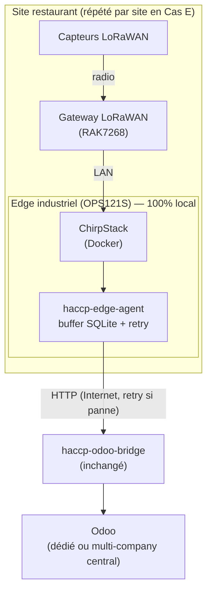

# Synthèse — Sortie de vNode : quelle architecture pour Cas D et Cas E

> Document de lecture rapide. Détails, rationale complète et décisions ligne à ligne : `2026-07-22-architecture-sans-vnode-design.md`.

## En une phrase

vNode (1300-2600€/site) est remplacé par un agent logiciel maison + ChirpStack auto-hébergé **directement sur l'edge industriel déjà présent sur site** — même niveau de résilience (voire mieux), même matériel, zéro licence.

## Le choix clé : où tourne le LNS (TTN ou ChirpStack) ?

| # | LNS | Emplacement | Buffer/agent | Résiste panne VPS Odoo | Résiste coupure Internet resto | Coût additionnel/site | Retenu pour |
|---|---|---|:---:|:---:|:---:|---|---|
| 1 | TTN cloud | Managé TTI | Sur edge local | ✓ | ✗ | 0€ | — |
| 2 | TTN cloud | Managé TTI | Sur VPS indépendant | ✓ | ✗ | ~5€/mois | Tier "lean", sans edge node |
| 3 | ChirpStack | VPS indépendant | VPS | ✓ | ✗ | ~15€/mois | — |
| **4** | **ChirpStack** | **Edge local (OPS121S)** | **Même edge** | **✓** | **✓** | **0€** | **Cas D & Cas E (défaut)** |

**Pourquoi l'option 4 gagne :** en faisant tourner ChirpStack directement sur la même machine edge que l'agent, tout le trajet capteur → gateway → LNS → buffer reste sur le réseau local du restaurant, sans jamais toucher Internet. Seule la synchro finale vers Odoo a besoin d'Internet — et c'est exactement ce que le buffer encaisse déjà. Résultat : résiste à une panne du VPS Odoo **et** à une coupure Internet du restaurant, sans surcoût (le matériel edge est déjà budgété).

## Ce qui change par rapport à l'architecture actuelle (Cas D / POC)

| Composant | Avant | Après |
|---|---|---|
| LNS | TTN cloud | ChirpStack self-hosted, sur l'edge |
| Ingestion + parsing | vNode MqttClient (parser custom JS) | `haccp-edge-agent` (Python, même logique de parsing portée) |
| Buffer / résilience | vNode RestApiClient + buffer SQLite vNode | `haccp-edge-agent` (buffer SQLite maison) |
| Envoi vers Odoo | vNode → `haccp-odoo-bridge` (HTTP) | `haccp-edge-agent` → `haccp-odoo-bridge` (**même contrat HTTP, bridge inchangé**) |
| Debug live (Claude Code) | vNode McpServer | À redéfinir si besoin (hors périmètre) |
| Licence | 1300-2600€/site | 0€ |

## Schéma cible

## Impact économique

| | Cas D (1 site) | Cas E — exemple 10 sites |
|---|---|---|
| Licence vNode évitée | ~1300€ (one-shot) | ~13 000€ (one-shot) |
| ChirpStack central mutualisé | — | supprimé du besoin (chaque site autonome) |
| Matériel edge | inchangé (~200€) | inchangé (~200€ × N) |
| Odoo / logiciel récurrent | inchangé | inchangé |

## Tableau des 6 cas (A→F) — mise à jour

| Cas | Nom | Impact de ce spec |
|---|---|---|
| A | CE + OCA Quality | Inchangé |
| B | VPS Lean · TTN Direct | Inchangé — reste le tier "lean" (Option 2 ci-dessus), pas de vNode déjà prévu |
| C | VPS Full Stack (ChirpStack + vNode) | **Obsolète** — remplacé par l'Option 4 (ChirpStack sur edge, pas sur VPS), le blocage licence vNode virtuel devient sans objet |
| D | Moyen Resto + Edge Node | **Mis à jour** — vNode retiré, ChirpStack + `haccp-edge-agent` sur le même edge |
| E | Chaîne Multi-sites | **Mis à jour et simplifié** — plus de ChirpStack central mutualisé, chaque site autonome avec sa propre Option 4 ; seul Odoo reste centralisé |
| F | Collectivité | Inchangé |

## Ce qui reste ouvert

- Filtrage "on change" vs transmission continue des mesures dans `haccp-edge-agent`.
- Adapter (ou remplacer) `scripts/demo-simulate-sensor.py` pour ChirpStack.
- Dimensionnement RAM/CPU de l'edge avec ChirpStack en plus de Mosquitto/InfluxDB/Portainer.
- Dual-WAN (Dream Machine SE) repositionné en **option premium "temps réel garanti"**, plus en pré-requis de résilience — reste vendable séparément.

Détails complets : `2026-07-22-architecture-sans-vnode-design.md`.
